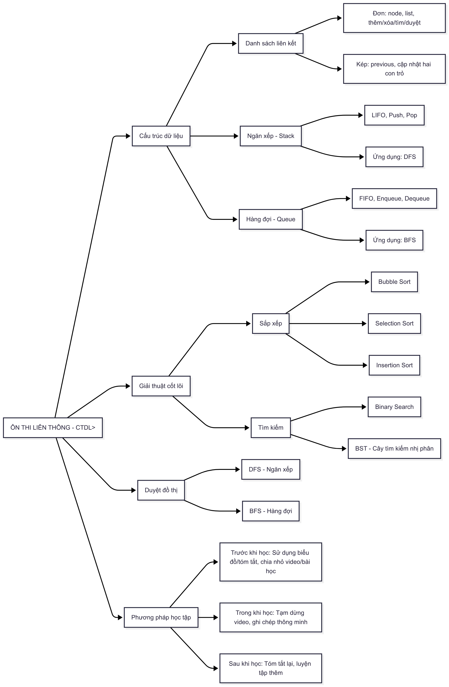

# ÔN THI LIÊN THÔNG - CẤU TRÚC DỮ LIỆU & GIẢI THUẬT

## Mục tiêu ôn tập

- Hiểu rõ bản chất và vai trò của môn học trong chương trình liên thông CNTT.
- Nắm vững các cấu trúc dữ liệu cơ bản, thao tác và ứng dụng thực tiễn.
- Thành thạo các giải thuật cốt lõi: sắp xếp, tìm kiếm, duyệt đồ thị.
- Sẵn sàng cho kỳ thi với kiến thức hệ thống, đầy đủ và thực hành tốt.

## Tóm tắt nội dung cần học

- **Cấu trúc dữ liệu cơ bản:** Danh sách liên kết đơn/kép, ngăn xếp, hàng đợi.
- **Giải thuật cốt lõi:** Sắp xếp (Bubble Sort, Selection Sort, Insertion Sort), tìm kiếm (Binary Search, BST).
- **Duyệt đồ thị:** DFS (ngăn xếp), BFS (hàng đợi).
- **Thực hành mô phỏng:** Viết code, mô phỏng các bước giải thuật trên giấy.

### **I. Cấu trúc dữ liệu**

#### 1. Danh sách liên kết (Linked List)
- **Đơn:** Khai báo node, list; thêm (đầu/cuối), xóa, tìm kiếm, duyệt.
- **Kép:** Có thêm con trỏ previous; cập nhật cả hai con trỏ khi thêm/xóa.

#### 2. Ngăn xếp (Stack)
- Nguyên tắc LIFO (vào sau ra trước).
- Thao tác: Push, Pop.
- Ứng dụng: Duyệt đồ thị theo chiều sâu (DFS).

#### 3. Hàng đợi (Queue)
- Nguyên tắc FIFO (vào trước ra trước).
- Thao tác: Enqueue, Dequeue.
- Ứng dụng: Duyệt đồ thị theo chiều rộng (BFS).

### **II. Giải thuật cốt lõi**

#### 1. Sắp xếp (Sorting)
- **Bubble Sort:** So sánh và đổi chỗ các cặp phần tử liền kề.
- **Selection Sort:** Tìm phần tử nhỏ nhất/lớn nhất, đưa về đúng vị trí.
- **Insertion Sort:** Chèn lần lượt vào danh sách con đã sắp xếp.

#### 2. Tìm kiếm (Searching)
- **Binary Search:** Áp dụng cho mảng đã sắp xếp, chia đôi phạm vi tìm kiếm.
- **Cây tìm kiếm nhị phân (BST):** Nút trái < gốc < nút phải; thao tác tìm kiếm trên cây.

### **III. Duyệt đồ thị**

- **DFS:** Dùng ngăn xếp, duyệt theo chiều sâu.
- **BFS:** Dùng hàng đợi, duyệt theo chiều rộng.
- Mô phỏng quá trình duyệt bằng bảng theo dõi các bước.

---

## Biểu đồ kiến thức CTDL&GT

---

## Cách sử dụng sơ đồ này:

- **Làm Checklist:** Dùng như danh sách kiểm tra. Học xong phần nào, đánh dấu vào phần đó.
- **Ôn tập nhanh:** Trước mỗi buổi học, nhìn vào sơ đồ để nhớ lại kiến thức liên quan.
- **Kiểm tra kiến thức:** Chọn một "lá" bất kỳ trên sơ đồ (ví dụ: "Ngăn xếp") và thử định nghĩa, cho ví dụ về nó. Nếu làm được, bạn đã nắm chắc phần đó.

---

## Lời khuyên ôn tập

- **Thực hành:** Tự viết lại code cho các cấu trúc dữ liệu và giải thuật.
- **Mô phỏng:** Tập mô phỏng các giải thuật bằng tay trên giấy với bộ dữ liệu nhỏ.
- **Tận dụng tài liệu:** Xem lại file code mẫu đã được cung cấp để tham khảo cách cài đặt hoàn chỉnh.