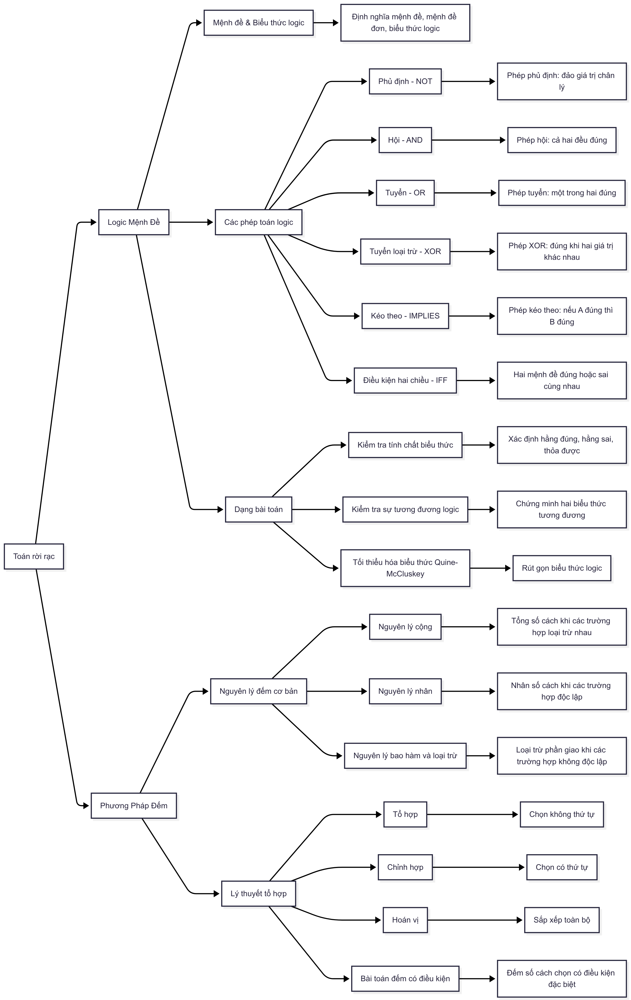

# ÔN THI LIÊN THÔNG - TOÁN RỜI RẠC

## Mục tiêu ôn tập

- Hiểu và vận dụng các khái niệm cơ bản của Toán rời rạc trong chương trình liên thông Đại học Giao thông Vận tải.
- Nắm vững các dạng bài tập thường gặp, phương pháp giải và kỹ năng phân tích, tư duy logic.
- Sẵn sàng cho kỳ thi với kiến thức hệ thống, đầy đủ và thực tiễn.

## Tóm tắt nội dung cần học

- **Logic mệnh đề:** Định nghĩa, các phép toán logic, bảng chân lý, kiểm tra tính chất và tối thiểu hóa biểu thức logic.
- **Phương pháp đếm:** Nguyên lý cộng, nguyên lý nhân, nguyên lý bao hàm và loại trừ, tổ hợp, chỉnh hợp, hoán vị, các bài toán đếm có điều kiện.

Dưới đây là danh sách các kiến thức trọng tâm bạn cần nắm vững để ôn tập và thi liên thông môn 
Toán rời rạc tại Đại học Giao thông Vận tải:

### **I. Logic Mệnh Đề**

#### 1. Mệnh đề và biểu thức logic
- **Mệnh đề** là một câu khẳng định đúng hoặc sai, nhưng không vừa đúng vừa sai. Ví dụ: "Hà Nội là thủ đô Việt Nam" là một mệnh đề đúng.
- **Mệnh đề đơn** là mệnh đề không chứa phép toán logic.
- **Biểu thức logic** là sự kết hợp các mệnh đề đơn bằng các phép toán logic để tạo thành mệnh đề phức.

#### 2. Các phép toán logic cơ bản
- **Phủ định (NOT, ¬A):** Đảo ngược giá trị chân lý của mệnh đề. Nếu A đúng thì ¬A sai và ngược lại.
- **Hội (AND, A ∧ B):** Đúng khi cả hai mệnh đề đều đúng.
- **Tuyển (OR, A ∨ B):** Đúng khi ít nhất một trong hai mệnh đề đúng.
- **Tuyển loại trừ (XOR, A ⊕ B):** Đúng khi hai mệnh đề có giá trị khác nhau.
- **Kéo theo (IMPLIES, A ⇒ B):** Đúng trừ trường hợp A đúng và B sai.
- **Điều kiện hai chiều (IFF, A ⇔ B):** Đúng khi cả hai mệnh đề cùng đúng hoặc cùng sai.

#### 3. Bảng chân lý
- Là bảng liệt kê giá trị đúng/sai của các mệnh đề và biểu thức logic với mọi trường hợp có thể của các biến.
- Dùng để kiểm tra tính chất biểu thức, chứng minh tương đương logic.

#### 4. Các dạng bài toán
- **Kiểm tra tính chất biểu thức:** Xác định biểu thức là hằng đúng, hằng sai, hay thỏa được bằng bảng chân lý.
- **Kiểm tra sự tương đương logic:** So sánh bảng chân lý của hai biểu thức.
- **Tối thiểu hóa biểu thức:** Sử dụng phương pháp Quine-McCluskey để rút gọn biểu thức logic.

---

### **II. Phương Pháp Đếm**

#### 1. Các nguyên lý đếm cơ bản
- **Nguyên lý cộng:** Nếu một công việc có thể được thực hiện theo n cách và một công việc khác có thể được thực hiện theo m cách, và hai công việc này không thể xảy ra đồng thời, thì tổng số cách thực hiện là n + m.
- **Nguyên lý nhân:** Nếu một công việc gồm hai bước, bước thứ nhất có n cách thực hiện, bước thứ hai có m cách thực hiện, và hai bước độc lập nhau, thì tổng số cách thực hiện là n × m.
- **Nguyên lý bao hàm và loại trừ:** Dùng để đếm số phần tử của hợp hai (hoặc nhiều) tập hợp có giao nhau. Số phần tử của hợp bằng tổng số phần tử từng tập trừ đi số phần tử giao nhau.

#### 2. Lý thuyết tổ hợp
- **Tổ hợp (Combination):** Chọn k phần tử từ n phần tử mà không quan tâm đến thứ tự. Số tổ hợp là \( C(n, k) = \frac{n!}{k!(n-k)!} \).
- **Chỉnh hợp (Chỉnh hợp, A(n, k)):** Chọn k phần tử từ n phần tử có quan tâm đến thứ tự. Số chỉnh hợp là \( A(n, k) = \frac{n!}{(n-k)!} \).
- **Hoán vị (Hoán vị, P(n)):** Sắp xếp toàn bộ n phần tử. Số hoán vị là \( P(n) = n! \).
- **Bài toán đếm có điều kiện:** Đếm số cách chọn hoặc sắp xếp khi có thêm điều kiện ràng buộc, ví dụ: phải chọn ít nhất một phần tử nhất định, hoặc một phần tử phải ở vị trí cố định.

* **Các nguyên lý đếm cơ bản:**
    * Vận dụng thành thạo **nguyên lý cộng**, **nguyên lý nhân**, và **nguyên lý bao hàm và loại trừ** để giải các bài toán đếm.
* **Lý thuyết tổ hợp:**
    * Phân biệt và áp dụng đúng các khái niệm **tổ hợp**, **chỉnh hợp**, và **hoán vị** trong các bài toán đếm.
    * Biết cách giải các bài toán đếm có điều kiện, ví dụ như đếm số cách chọn có chứa một phần tử nhất định hoặc có một phần tử ở vị trí cố định.

Chúc bạn ôn tập tốt và đạt kết quả cao trong kỳ thi! 👍

## Sơ đồ tư duy ôn tập Toán rời rạc

> **Sơ đồ tư duy dưới đây giúp bạn hệ thống hóa các kiến thức trọng tâm của môn Toán rời rạc, gồm hai phần lớn: Logic mệnh đề và Phương pháp đếm. Mỗi nhánh thể hiện các khái niệm, phép toán, dạng bài tập và phương pháp giải quyết thường gặp trong đề thi. Hãy sử dụng sơ đồ này để ôn tập, kiểm tra lại kiến thức và xác định các phần cần củng cố thêm.**

---

### SƠ ĐỒ TƯ DUY ÔN TẬP TOÁN RỜI RẠC

